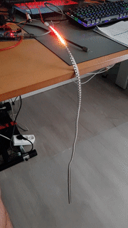

# Training projects for programmable LED strips
Examples use Arduino UNO, and RGBW WS2811 led strip with 125 LEDs, however convincing animations are possible with 30 LEDs.

LED strip is powered from external power supply. Depending on number of LEDs turned on up to 1.5 is drawn from the power supply.

Strip is driven from pin 6.

## Bouncing light example
